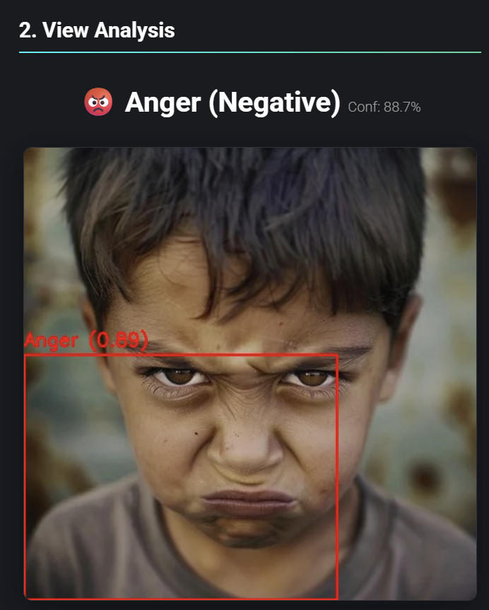

# 🎭 Real-Time Emotion and Sentiment Detection using YOLOv8

Deep Learning | Computer Vision | YOLOv8 | Emotion AI | Sentiment Analysis 

---

# 📌 Overview

This project implements a real-time Emotion Detection and Sentiment Analysis system using YOLOv8 and Deep Learning.

The system detects human facial emotions from images, videos, and converts the detected emotion into sentiment (Positive, Negative, Neutral).

The model is trained on the AffectNet dataset in YOLO format.

---

## 🎥 Demo Video

Click the image below to watch the demo:

[](https://drive.google.com/file/d/1jazLM9v0r8Y6RipcCwL3qNngM9HQaMzM/view?usp=sharing)


## 📸 Image Output Demo

### Emotion Detection Output




# 🚀 Features

- Real-time emotion detection
- Sentiment analysis from emotions
- Image emotion detection
- Video emotion detection
- YOLOv8 custom training
- Flask-based real-time dashboard
- High-speed inference

---

# 🧠 Emotion Classes

The model detects the following emotions:

- Anger
- Contempt
- Disgust
- Fear
- Happy
- Neutral
- Sad
- Surprise

---

# 💬 Sentiment Mapping

Emotion → Sentiment

| Emotion   | Sentiment |
|---------|-----------|
| Happy   | Positive  |
| Surprise| Positive  |
| Neutral | Neutral   |
| Sad     | Negative  |
| Anger   | Negative  |
| Disgust | Negative  |
| Fear    | Negative  |
| Contempt| Negative  |

---

# 🧠 Model Architecture

Model: YOLOv8 (Ultralytics)

Pipeline:

```
Input Image / Video
        ↓
YOLOv8 Model
        ↓
Face Detection
        ↓
Emotion Classification
        ↓
Sentiment Mapping
        ↓
Final Output
```

---

# 📊 Dataset

Dataset: AffectNet YOLO Format Dataset

Contains labeled facial emotion images.

Classes: 8 emotions

---

# ⚙️ Technologies Used

- Python
- YOLOv8 (Ultralytics)
- PyTorch
- OpenCV
- Flask
- NumPy

---

# 🧪 Training

Training performed using:

```
yolo detect train data=data.yaml model=yolov8n.pt epochs=100 imgsz=224
```

Supports:

- Image emotion detection
- Video emotion detection
- Sentiment analysis

---

# 🏗️ Project Structure

```
project/
│
├── training.ipynb
├── Yolo_test.ipynb
├── best.pt
├── data.yaml
└── README.md
```

---

# 🎯 Applications

- Emotion AI systems
- Mental health monitoring
- Smart surveillance
- Human-computer interaction
- Customer behavior analysis

---
